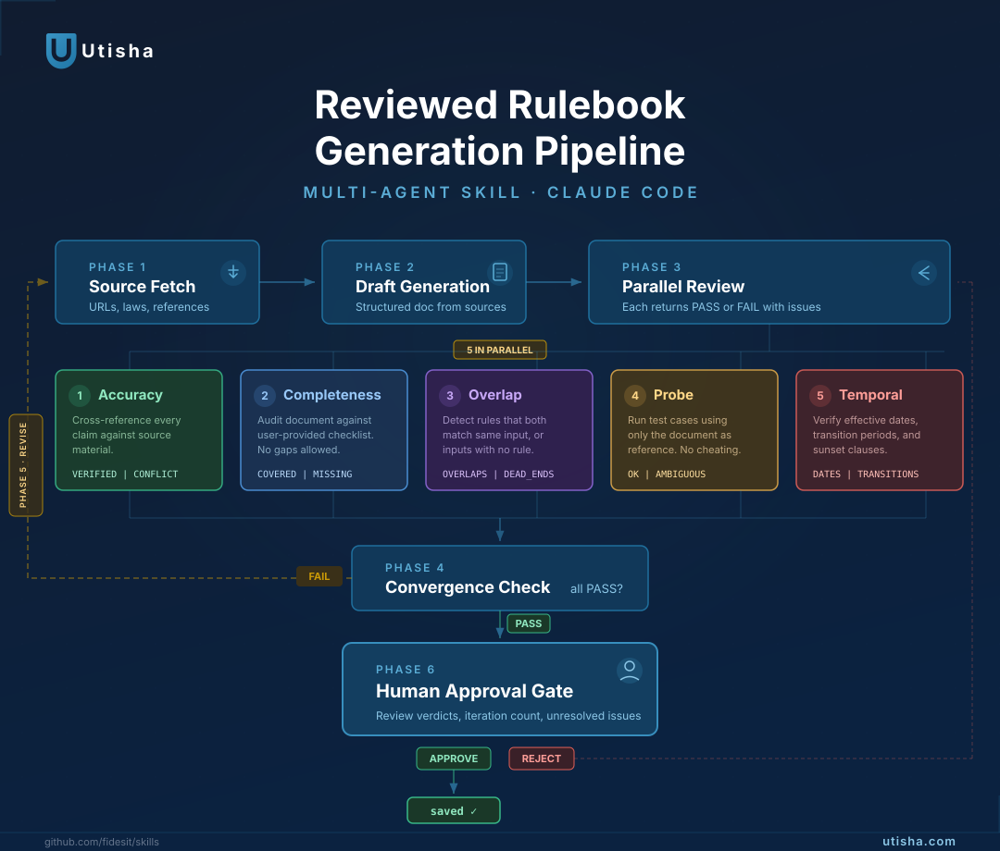

# utiska-skills

Reusable [Claude Code](https://claude.ai/code) skills for multi-agent workflows.

Drop a skill folder into your project's `.claude/skills/` directory and invoke it with `/skill-name` in Claude Code.

## Skills

### reviewed-rulebook

Multi-agent document generation with iterative AI peer review. An orchestrator generates a draft from authoritative sources, then fans out to **5 parallel reviewer subagents**. Each reviewer evaluates a different dimension of quality. The loop repeats until all reviewers pass or max iterations are reached, then the result goes through a human approval gate.



| Agent | Role | Passes when |
|-------|------|-------------|
| **Accuracy** | Cross-references every claim against source material | Zero conflicts, zero unverified claims |
| **Completeness** | Audits against a user-provided checklist | All items fully covered |
| **Overlap** | Detects rules that both match the same input, or inputs with no matching rule | Zero overlaps, zero dead ends |
| **Probe** | Runs test cases using only the document as reference | All cases resolve unambiguously |
| **Temporal** | Verifies effective dates, transition periods, sunset clauses | All dates match sources, transition logic explicit |

Between iterations, a **revision agent** addresses every flagged issue without touching anything else, appends to the changelog, and increments the version.

**Install**

```bash
cp -r skills/reviewed-rulebook/ your-project/.claude/skills/reviewed-rulebook/
```

**Invoke**

```
/reviewed-rulebook Document prompt: ...
Sources: ...
Completeness checklist: ...
Probe cases: ...
Max iterations: 3
```

**Structure**

```
skills/reviewed-rulebook/
├── SKILL.md                        # Orchestrator — 6-phase pipeline
├── reviewed-rulebook-infographic.svg     # Visual explainer
└── prompts/
    ├── source-fetcher.md           # Phase 1: fetch and digest sources
    ├── draft-generator.md          # Phase 2: generate initial document
    ├── reviewer-accuracy.md        # Phase 3: verify claims against sources
    ├── reviewer-completeness.md    # Phase 3: audit checklist coverage
    ├── reviewer-overlap.md         # Phase 3: detect ambiguity and gaps
    ├── reviewer-probe.md           # Phase 3: run test cases
    ├── reviewer-temporal.md        # Phase 3: validate dates and transitions
    └── revision-agent.md           # Phase 5: targeted fixes from feedback
```

## License

MIT
